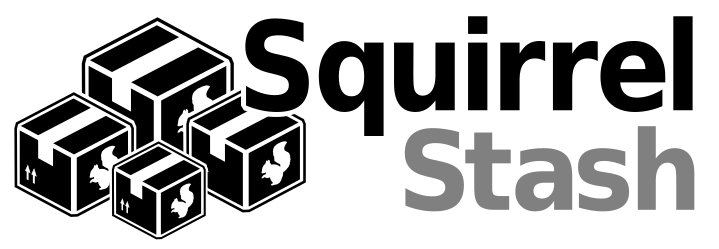

| [docs](.) / readme.md |
|:---|

# SquirrelStash
Server Implementation for Squirrel.Windows to provide a mechanism to limit updates to authorized users. It is used in conjunction with [Squirrel for Windows](https://github.com/Squirrel/Squirrel.Windows) to provide a simple deployment mechanism for licensed desktop software.

### *PROJECT STATUS*
*This project is currently pre-alpha and is being developed to meet an internal company need with the intent to share the solution with the community once it is stable. Use at your own risk.*

## Goals
This project has the following goals for a minimal viable product:

1. **Simple and Minimal** - simple minimal interface consistent with the mindset presented with Squirrel.Windows. Uses Squirrel.Windows packages and packaging mechanism.
2. **Licensed Use** - provide an effective solution for using Squirrel.Windows for licensed desktop software deployment and updates.
3. **Secure Delivery to Authorized Users** - securely deliver software updates to authorized users from authenticated SquirrelStash servers.
4. **Host Multiple Applications and Installs** - a single SquirrelStash server can serve updates to multiple applications and sites 

## Minimal Viable Product (MVP) Features
This project has the following goals for a minimal viable product:

1. **Server & Application Authentication** - verify that the updates are from a valid SquirrelStash server and are going to an existing application user
2. **Registration and Verification before Downloading** - minimal bootstrap application to perform user registration and verification before downloading actual application.
2. **Site Specific Releases** - ability to keep different sites on different versions of the application (e.g., site A on 1.2  and site B on 1.3)
3. **Upload New Releases** - easily upload new releases (and provide delta releases - even when intermediate release)

## Value Added Features
This project has the following goals for a minimal viable product:

4. **Multiple Release Channels** - provide a mechanism to easily specify alternate release channels based on user groups (e.g., 3.1-alpha, 3.1-beta, 3.1-stable, 3.2-alpha, 3.2-beta).
5. **Configuration Vault** - use registration and authentication mechanism to serve a configuration file for initial install with settings such as db connection string.
6. **Application Disabling and De-registration** - disable application if no longer authorized and de-register an installation on uninstall (to release license for other use).
5. **Basic Logging** - basic logging and statistics of information such as number of downloads per release.

## Major Components
The following major components of the system will be developed:

* **Web Application**
	* ASP.NET MVC Core web application to serve the `Release` file and full or incremental NuGet packages.
	* URL path is used for user authentication and identification (e.g., `squirrelstash.myserver.com/myapp/001c42000006/` )
	* Application manager interface to manage application releases and settings
* **Client SquirrelStash Library**
	* Client tools to generate the correct URL to pass to Squirrel.Windows update method.
* **Client SquirrelStash Tool**
	* Tool to assist in the upload of a new release to the SquirrelStash server

## Usage

This section provides an overview of the programmer usage of SquirrelStash.

### Create a new Stash for an Application

An application Stash needs to be created on the server before you can interact with the stash (e.g., upload and update applications). This is only done once for each app.

~~~psSquirrelStash
PM> SquirrelStash --createStash MyApp --server stash.myapp.com --adminPassword AdminStashPassword -appPassword MyAppStashPassword
Creating 'MyApp' Stash ... done.
Generating 'MyApp' public/private key ... done.
MyApp Public Key: <RSAKeyValue><Modulus>xrhMoG5.....=</Modulus><>/RSAKeyValue>
Important: Record your Public Key as it will be required by the StashManager.
'MyApp' Stash Ready.
~~~

### Preparing a Squirrel Application for SquirrelStash

The first step in using SquirrelStash is creating a `StashSetup.exe` for MyApp. This is a specialized version of a standard Squirrel.Windows `Setup.exe` that prompts for registration with a SquirrelStash server before downloading the full version of MyApp using the Squirrel `UpdateManager`. This step is only required once for a given MyApp.

**Note:** This step may not need to be called explicitly, I may be able to generate this file on the server on the first time that we call the `SquirrelStash --upload` method. 

~~~ps
PM> SquirrelStash --stashify MyApp --server squirrelstash.myapp.com --appPassword MyAppStashPassword
Creating StashSetup.exe for MyApp ... done.
~~~

### Integrating SquirrelStash with MyApp

There are a couple of additional pre-steps in the application update process.

**`Program.cs`**

~~~cs
using Squirrel;
using SquirrelStash;
~~~

**`static void Main()`**

~~~cs

var stash = new StashManager("https://stash.myapp.com", myAppPublicKey);
if (stash.InstallVerified())
{
	using (var mgr = new UpdateManager(stash.UpdateUrl))
	{
	    await mgr.UpdateApp();
	}
}
else
{
	MessageBox.Show("Invalid Registration");
	Application.Exit();
}
~~~

### Uploading MyApp Packages to Stash Server

The `SquirrelStash` tool can be used to upload the `StashSetup.exe` as well as any newly generated packages and `RELEASES` file. It would verify which files need to be uploaded based on the difference of the `RELEASES` file already on the Stash Server from the one in the `Releases` directory.

~~~pm
PM> SquirrelStash --upload MyApp --server ssquirrelstash.myapp.com --appPassword MyAppStashPassword
Uploading StashSetup.exe            |######################|
Uploading MyApp-1.0.0-full.nupkg    |######################|
Uploading MyApp-1.0.1-delta.nupkg   |######################|
Uploading MyApp-1.0.1-full.nupkg    |######################|
Uploading RELEASES                  |######################|
Stash Complete!
~~~

## Documentation
For more information about specific aspects of the system see the documentation:

* [**Registration and Authentication**](docs/RegistrationAndAuthentication.md) - process used by SquirrelStash to register new users and authenticate existing users before allowing updates.